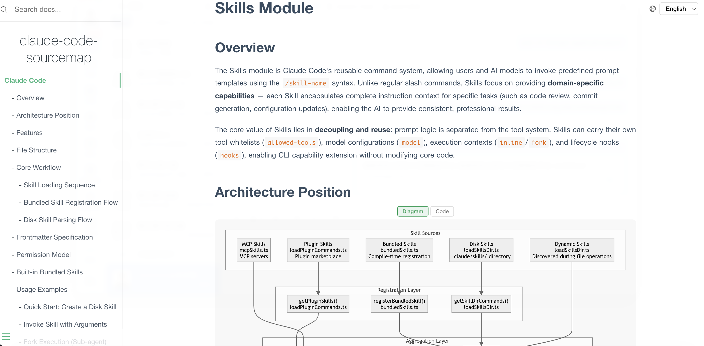

<p align="center">
  
</p>

# Nium-Wiki

English | [中文](README.zh.md)

A skill for AI coding tools (e.g., Claude Code) that turns codebases into high-quality wikis. Auto-analyzes structure, generates docs with diagrams and cross-references. Inspired by DeepWiki, ZRead, Code Wiki.

## Features

- 🚀 **Deep Code Analysis**: Semantic understanding of your codebase, beyond syntax parsing
- 📊 **Mermaid Diagrams**: Auto-generated architecture, data flow, and dependency diagrams
- 🔗 **Cross-linked Documentation**: Bidirectional links between docs with source traceability
- ⚡ **Idempotent Incremental Updates**: Safe to re-run anytime — SHA256 diff + dep-graph propagation rewrite only the pages affected by code changes, preserving every other doc untouched
- ➕ **Additive by Design**: New modules, new secondary languages, and hand-edited domain pages coexist across re-runs — no full-wiki rebuild, no clobbering existing content
- 💡 **Compiled, Not Retrieved**: Aligned with the Karpathy LLM Wiki pattern — docs are compiled upfront, updated incrementally
- 🌐 **Multi-language Support**: Works with JS/TS/Python/Go/Rust/Java and 10+ languages
- 🧭 **Import-Graph Module Discovery**: Language-agnostic module discovery via dependency graph, paired with two-phase fact extraction for accurate API docs
- 🔒 **Fully Offline**: Zero external dependencies, works in air-gapped environments
- 📝 **Professional Output**: Enterprise-grade documentation with automated quality auditing

## Quick Start

### Installation

Before using Nium-Wiki, you need to add it as a skill to your AI coding tool:

```bash
npx skills add https://github.com/niuma996/nium-wiki --skill nium-wiki
```

Nium-Wiki works as an AI coding tool skill (e.g. Claude Code). Just tell the AI:

```
# In Claude Code, say:
> generate wiki
> create docs
> update wiki
> rebuild wiki
```

The skill will automatically run the full workflow: init → analyze → deep code reading → generate docs → build index → audit quality.

For incremental updates after code changes:

```
> update wiki
```

Changed files are detected via SHA256 hashing. The `incremental` command combines diff analysis, dependency graph traversal, and doc-to-doc propagation to pinpoint affected wiki pages — regenerating only what changed, nothing more.

### Generated Output Structure

```
.nium-wiki/
├── config.json              # Language & exclude settings
├── meta.json                # Version, timestamps, stats
├── cache/
│   ├── structure.json       # Project structure snapshot
│   ├── source-index.json    # SHA256 file hashes (change detection)
│   ├── doc-index.json       # Source ↔ Doc bidirectional mapping
│   ├── dep-graph.json       # Import/require dependency graph
│   └── facts/               # Per-module fact extraction cache
└── wiki/                    # Generated documentation
    ├── index.md             # Project homepage
    ├── architecture.md      # System architecture + Mermaid diagrams
    ├── getting-started.md   # Quick start guide
    ├── doc-map.md           # Documentation relationship map
    ├── api/                 # API reference docs
    ├── <domain>/            # Domain-organized module docs
    │   ├── _index.md        # Domain overview
    │   └── <module>.md      # Module documentation
    └── ...
```

### Multi-language Support

```bash
# Initialize with primary (first) + secondary language
npx nium-wiki init --lang zh/en
```

Secondary language docs are generated in `wiki_{lang}/` directories (e.g. `.nium-wiki/wiki_en/`), mirroring the same structure as `wiki/`.

### Local Preview

```bash
# Install
npm install -g nium-wiki

# Start local documentation server (default port 4000)
npx nium-wiki serve

# Specify port
npx nium-wiki serve --port 3000

# Specify wiki directory
npx nium-wiki serve .nium-wiki/wiki
```

Open `http://localhost:4000` in your browser to preview the generated docs, with full-text search, sidebar navigation, Mermaid diagram rendering, and a **source code drawer** that opens when you click any source file link in the wiki.

<p align="center">
  
</p>

### Wiki Generation Showcase

See [claude-code-sourcemap-wiki](https://github.com/niuma996/claude-code-sourcemap-wiki) for a live example of a full project generated with Nium-Wiki.

### Configuration

After initialization, a default config is generated at `.nium-wiki/config.json`:

```json
{
  "language": "zh",
  "exclude": [
    "node_modules", ".git", "dist", "build",
    "coverage", "__pycache__", "venv", ".venv"
  ],
  "useGitignore": true
}
```

| Field          | Type       | Default   | Description                                                                                                                                        |
| -------------- | ---------- | --------- | -------------------------------------------------------------------------------------------------------------------------------------------------- |
| `language`     | `string`   | `en`      | Documentation language. Supports `zh`, `en`, `ja`, `ko`, `fr`, `de`. Use `/` for multi-language, e.g. `zh/en` (primary Chinese, secondary English) |
| `exclude`      | `string[]` | see above | Directories to exclude from code analysis and doc generation                                                                                       |
| `useGitignore` | `boolean`  | `true`    | Automatically read `.gitignore` directory rules and merge into the exclude list                                                                    |

> In addition to custom excludes in `config.json`, the tool has built-in common exclude directories (`.git`, `.idea`, `.vscode`, `node_modules`, `dist`, etc.) and language-specific rules from each handler (e.g. Python's `__pycache__`, Go's `vendor`), so no manual configuration is needed for those.

## Offline-First Design

Nium-Wiki is designed to work completely offline with **zero external dependencies**, perfect for enterprise internal networks and air-gapped environments:

### Preview Server

- ✅ All frontend assets (Docsify, Prism.js, Mermaid) are bundled locally
- ✅ No CDN requests or external API calls

## Token Cost

Nium-Wiki is designed to leverage the AI coding tool's existing understanding of your project (from the Explore process), guiding it to output documentation in a structured way — rather than analyzing the entire codebase from scratch.

| Scenario                                | Token Cost | Notes                                                                                                                   |
| --------------------------------------- | ---------- | ----------------------------------------------------------------------------------------------------------------------- |
| First generation (with Explore context) | Moderate   | The AI tool already understands the project structure, jumping straight to doc generation. Cost depends on project size |
| First generation (fresh project)        | Higher     | Requires a full code reading and analysis pass — essentially a deep Explore + doc generation                            |
| Incremental updates                     | Very low   | Detects code changes via SHA256 hashing, pinpoints affected docs for targeted updates                                   |
| Multi-language translation              | Very low   | Translates after primary language docs are complete, also supports incremental update logic                             |

> For projects where you've been using an AI coding tool for a while, the first generation cost is typically reasonable. Day-to-day usage is dominated by incremental updates, which cost very little.

## Upcoming Features

- Continuously optimizing documentation quality while reducing model interaction rounds
- Centralized documentation management service
- Intelligent search tooling (cross-project)
- Karpathy LLM Wiki Schema Layer: extend the existing module-facts schema to cover wiki organization rules (domain partitioning, section contracts, cross-doc relations) and drive section-level incremental updates from it

## Use Cases

- **Enterprise Documentation**: Generate comprehensive docs for internal projects
- **Open Source Projects**: Maintain up-to-date documentation automatically
- **Code Reviews**: Visualize architecture and dependencies
- **Onboarding**: Help new developers understand the codebase
- **Air-gapped Environments**: Works completely offline

## Contributing

Contributions are welcome! Please feel free to submit a Pull Request.

## License

MIT

## Links

- [GitHub Repository](https://github.com/niuma996/nium-wiki)
- [Issue Tracker](https://github.com/niuma996/nium-wiki/issues)

***

*Generated with ❤️ by Nium-Wiki*
