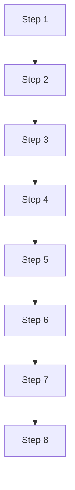
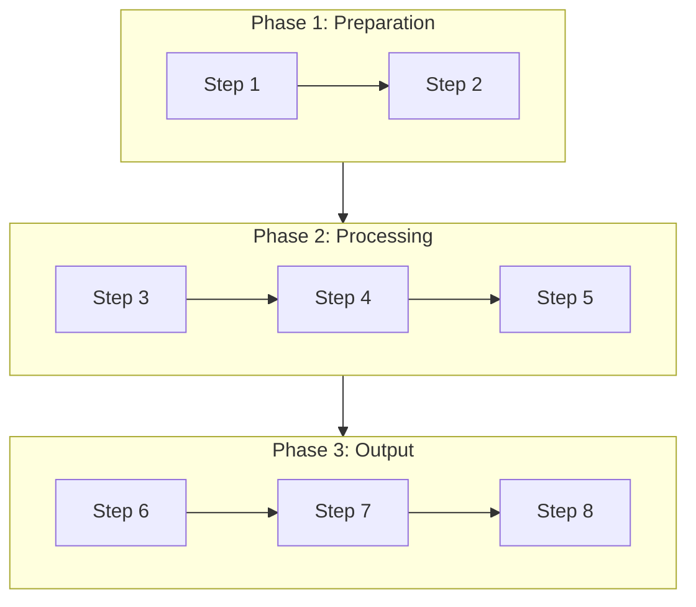
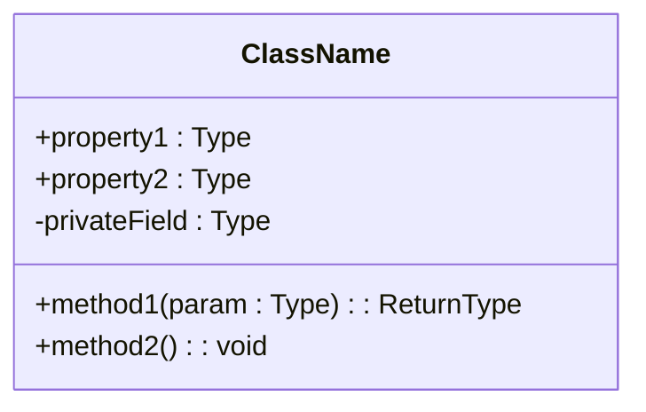

# Nium Wiki Generator

Produce **professional-grade**, domain-organized project Wiki under the `.nium-wiki/` directory.

> **Core Principle**: Generated documentation must be **detailed, structured, diagrammed, and cross-linked**, meeting enterprise-level technical documentation standards.

## Quality Gate for Generated Documentation

**MANDATORY**: Every piece of generated documentation MUST satisfy the following criteria:

### Depth of Coverage
- Provide **full context** for every topic — never leave bare lists or placeholder outlines
- Write **specific, explanatory** descriptions that address the WHY and HOW behind each concept
- Supply **runnable code examples** paired with their expected output (🔴 secrets must be sanitized - see "Secret & Credential Sanitization")
- Call out **edge cases, caveats, and common mistakes** explicitly

> **Substantive content**: A section has real content if it contains ≥ 3 non-empty, non-heading
> lines, OR at least one code block, diagram, or table. A heading followed by a single sentence
> or a bare list does not count.

### Structural Conventions
- Organize content with **hierarchical headings** (H2 → H3 → H4) to form a clear information hierarchy
- Summarize key concepts in **tables** for scanability
- Illustrate processes and flows using **Mermaid diagrams**
- Interconnect documents via **cross-links**

### 🔴 MANDATORY: Link Path Format

> ALL source file links MUST use project-root-relative POSIX paths starting with `/`.
> NEVER use `file://` URIs, absolute filesystem paths, or OS-specific paths.
> The IDE/editor may provide file paths as `file:///Users/.../project/src/foo.ts` — you MUST strip the prefix and convert to `/src/foo.ts`.

| ❌ Wrong | ✅ Correct | Reason |
|----------|-----------|--------|
| `[foo.ts](file:///Users/x/project/src/foo.ts#L1-L50)` | `[foo.ts](/src/foo.ts#L1-L50)` | Strip `file://` prefix + absolute path |
| `[foo.ts](src/foo.ts#L1-L50)` | `[foo.ts](/src/foo.ts#L1-L50)` | Must start with `/` |
| `[foo.ts](C:\Users\x\project\src\foo.ts)` | `[foo.ts](/src/foo.ts)` | No Windows paths |

**Conversion rule**: Given any absolute path, remove everything up to and including the project root directory name, then prepend `/`. Example: `file:///home/user/my-project/src/core/foo.ts` → `/src/core/foo.ts`.

### 🔴 MANDATORY: Secret & Credential Sanitization

> **CRITICAL**: NEVER include actual secrets, credentials, API keys, or sensitive information in generated documentation.

**MANDATORY sanitization rules**:

| Scenario | Action | Example |
|----------|--------|---------|
| Hard-coded API keys in source | Replace with placeholders | `sk_live_abc123` → `sk_live_XXXXXXXXXXXX` |
| Database credentials | Redact or use example values | `password: "mysecret123"` → `password: "***REDACTED***"` |
| Private tokens/keys | Mask with descriptive placeholders | `TOKEN=secret123` → `TOKEN=<your-api-token-here>` |
| Environment vars with secrets | Show safe example values | `AWS_SECRET_ACCESS_KEY=xyz` → `AWS_SECRET_ACCESS_KEY=<your-secret-key>` |

**Sanitization pattern library**:
- API keys: `sk_live_XXXXXXXX`, `pk_test_XXXXXXXX`, `api_key_XXXXXXXX`
- Passwords: `***REDACTED***`, `<your-password-here>`
- Tokens: `<your-access-token>`, `<auth-token-here>`
- Generic: `XXXXXXXX`, `<secret-value>`, `<sensitive-data>`

**Exception**: Mermaid diagrams, source file path links, and markdown structure MUST still be preserved unchanged (except for secret removal within code blocks).

### Diagram Requirements (at least 2-3 per document)
| Content Type | Diagram Type | Condition |
|--------------|--------------|-----------|
| System architecture | `flowchart TB` with subgraphs | always |
| Request / data flow | `sequenceDiagram` | always |
| Lifecycle / state transitions | `stateDiagram-v2` | always |
| **Class / Interface shape** | `classDiagram` with properties + methods | always |
| Module dependencies | `flowchart LR` | always |
| Data models / ORM | `erDiagram` | when project has database/ORM |
| Module conceptual relationships | `mindmap` | optional, for abstract module relationships only (NOT file trees) |

> **Diagram diversity**: Count ≥ 2 distinct diagram *types* toward the minimum. Three identical
> flowcharts do not satisfy the requirement — use `classDiagram`, `sequenceDiagram`,
> `stateDiagram-v2`, `erDiagram` as appropriate for the module.

**Layout rules**: Choose direction by content — `TB` for hierarchies, `LR` for flows/dependencies. Use `subgraph` to group related nodes when count > 6. Apply `style` color coding to highlight key nodes.

> **File/directory structure** MUST use plain-text tree format (`├──` `└──`), NEVER use Mermaid diagrams (including `mindmap`).
> Mermaid `mindmap` is only for showing abstract conceptual relationships between modules, never for file paths or directory trees.

### 🔴 Diagram Complexity Optimization Rules

When linear flowcharts exceed 6 nodes, **MUST** apply visual optimization to avoid long, narrow waterfall-style diagrams.

| Node Count | Optimization Strategy | Description |
|------------|----------------------|-------------|
| ≤ 6 | No optimization needed | Use linear flow directly |
| 7-12 | `subgraph` grouping | Group nodes into 2-4 subgraphs by logical phases |
| 13-20 | Layered abstraction | High-level overview + detailed phase diagrams |
| > 20 | Split into multiple diagrams | Each diagram focuses on one phase, linked via cross-references |

**Grouping principles**:
- Group by business phases (e.g., Initialization → Detection → Collection → Output)
- Each `subgraph` contains 2-4 nodes, max 5
- Connect subgraphs with concise edges to show phase transitions
- Add semantic titles to subgraphs (e.g., `subgraph Init["Initialization Phase"]`)

**Example — Optimize linear flow into grouped flow**:

❌ Avoid:


✅ Recommended:


### 🔴 Mermaid Syntax Safety Rules (v10.9+ Compatible)

> ⚠️ **These rules are enforced before every diagram generation.**
> Skipping them causes silent render failures. Read and apply them before writing any Mermaid block.

When generating Mermaid diagrams, **MUST** follow these rules to ensure error-free rendering:

| Rule | Correct | Incorrect | Reason |
|------|---------|-----------|--------|
| Node labels must be quoted | `A["CLI Entry"]` | `A[CLI Entry]` | Labels with spaces/non-ASCII fail without quotes |
| Node IDs must be alphanumeric | `CoreModule["Core Module"]` | `CoreModule123["Core Module"]` | Non-ASCII IDs incompatible in some versions |
| subgraph IDs must be English | `subgraph Core["Core Layer"]` | `subgraph CoreLayer` | Non-ASCII subgraph IDs unstable |
| **subgraph ID must not duplicate internal node ID** | `subgraph CL["CLI Layer"]` + `CLI["cli.ts"]` | `subgraph CLI["CLI Layer"]` + `CLI["cli.ts"]` | subgraph ID and node ID share a namespace; duplicates cause rendering errors |
| Escape quotes in labels with HTML entities | `A["Config &quot;key&quot;"]` | `A["Config "key""]` | Nested quotes break syntax |
| sequenceDiagram participant IDs must be alphanumeric | `participant U as User` | `participant User123` | Non-ASCII participant IDs may error |
| Avoid mermaid reserved words as IDs | `NodeClass["class"]` | `class["class"]` | `class` is a reserved keyword |

**One-line principle**: IDs in English, labels in quotes, special chars as HTML entities.

### 🔴 MANDATORY: Source File Back-References

**Each section MUST end with links back to the originating source files** (see "Link Path Format" above for path rules):

```markdown
**Source references**
- [cli.ts](/src/cli.ts#L1-L50)
- [index.ts](/src/index.ts#L20-L80)

**Diagram data sources**
- [core/analyzeProject.ts](/src/core/analyzeProject.ts#L1-L100)
```

### 🔴 MANDATORY: Complexity-Scaled Quality Targets

**Quality standards scale with module complexity — not fixed numbers.**

| Module Role | Doc Depth | Code Examples | Diagrams |
|-------------|-----------|---------------|----------|
| core | Comprehensive (use `module.md`) | 3+ | 2+ |
| util / config | Concise (use `module-simple.md`) | 1-2 | 1 |
| test / example | Minimal (use `module-simple.md`) | 1 | optional |

**General rules**: larger source files → longer docs; more exports → more examples; more dependents → more diagrams.

#### Context Adaptation

| Project Type | Focus Areas |
|-------------|-------------|
| **frontend** | Component Props, state management, UI interaction |
| **backend** | API endpoints, data models, middleware |
| **fullstack** | Frontend-backend interaction, data flow, deployment |
| **library** | API docs, type definitions, compatibility |
| **cli** | Command arguments, config files, usage |

| Language | Example Style |
|----------|--------------|
| **TypeScript** | Type annotations, generics, interfaces |
| **Python** | Docstrings, type hints, decorators |
| **Go** | Error handling, concurrency, interfaces |
| **Rust** | Ownership, lifetimes, error handling |

### Module Document Sections

Use `module.md` (11 sections) for core modules, `module-simple.md` (6 sections) for util/config/helper modules.

**Full template (`module.md`) — for core modules:**

| # | Section | Content |
|---|---------|---------|
| 1 | **Overview** | Intro + value proposition + architecture role (2-3 paragraphs) |
| 2 | **Architecture Position** | Mermaid diagram highlighting module position |
| 3 | **Feature Table** | Features with related APIs |
| 4 | **File Structure** | File tree + responsibilities |
| 5 | **Core Workflow** | Mermaid flowchart |
| 6 | **State Diagram** | ⚡ OPTIONAL — only for stateful modules |
| 7 | **API Summary** | Overview table + link to api.md (no detailed signatures) |
| 8 | **Usage Examples** | 1-3 examples (first = Quick Start) |
| 9 | **Best Practices** | Recommended / avoid patterns |
| 10 | **Design Decisions** | ⚡ OPTIONAL — only for core modules with significant choices |
| 11 | **Dependencies & Related Docs** | Dependency diagram + cross-links |

**Lightweight template (`module-simple.md`) — for util/config/helper/test modules:**

| # | Section | Content |
|---|---------|---------|
| 1 | **Overview** | 1 paragraph |
| 2 | **API Summary** | Overview table + link to api.md |
| 3 | **Usage Examples** | 1-2 examples |
| 4 | **File Structure** | File tree |
| 5 | **Best Practices** | ⚡ OPTIONAL |
| 6 | **Related Docs** | Cross-links |

**Template selection**: Before generating each module's documentation, run `nium-wiki analyze-module <module-path>` (or `--batch` for all modules) to get structured signals. Use the output as **context** — the `roleRecommendation` and `templateRecommendation` are based on quantifiable metrics (export count, complexity score, dependency stats) but are **overrideable**: your semantic understanding of the module's business role takes precedence.

> Code provides signals. You make the final decision.

### 🔴 Code Examples

Every code example must:

1. **Complete and runnable**: Include import, initialization, invocation, result handling
2. **Cover exported interfaces**: At least 1 example per major exported API
3. **Include comments**: Explain key steps and design intent
4. **Match project language**: Follow language best practices
5. **Tiered examples for core APIs**: Three levels — basic usage, advanced usage, and error handling
6. **Sanitized secrets**: NO actual credentials — use placeholders (see "Secret & Credential Sanitization" above)

### 🔴 MANDATORY: classDiagram for Every Core Class

Each core class or interface MUST have an accompanying classDiagram showing its full shape:



### Cross-Document Linking
- Every document MUST contain a **"Related Documents"** section at the end
- Module docs should link outward to: architecture position, API reference, dependency graph
- API docs should link back to: parent module, usage examples, type definitions

---

## Workflow

### 0. CLI Commands Quick Reference

```bash
node bin/index.js init [path] --lang <code>  # Initialize .nium-wiki directory (lang: zh/en/ja/ko/fr/de)
node bin/index.js analyze [path]           # Analyze project structure
node bin/index.js analyze-module <path> [--batch|--json]  # Analyze module: classify role, recommend template
node bin/index.js diff-index [path]        # Detect file changes (--no-update to skip hash write)
node bin/index.js build-index [path]       # Build source ↔ doc mapping index
node bin/index.js build-deps [path]        # Build import/require dependency graph
node bin/index.js audit-docs <dir> [--verbose|--json]  # Check doc quality
node bin/index.js serve [wiki-path]        # Start docsify server
```

For detailed usage, see `node bin/index.js --help`

### 1. Initialization Check

Check if `.nium-wiki/` exists:
- **Not exists**: Run `node bin/index.js init --lang <code>` to create directory structure.
  Determine `<code>` by examining the project's natural language (README, code comments, docs) and the language the user is communicating in. Use `en` if unclear.
- **Exists**: Read `config.json` and cache, perform incremental update

### 2. Language Configuration

Read `.nium-wiki/config.json` and extract the `language` setting.
Format is slash-separated: the first language is the **primary language** (e.g. `zh`, `en`, `zh/en`).

- Generate **all primary documentation** in the primary language to `.nium-wiki/wiki/`.
- If secondary languages are configured (e.g. `zh/en` means primary=zh, secondary=en), after primary docs are written, translate all wiki documents into `wiki_{lang}/` directories (e.g. `.nium-wiki/wiki_en/`). See **Step 9** for details.

> **Convention**: `wiki/` = primary language, `wiki_{lang}/` = secondary language. The translated directory must mirror the exact same structure and filenames as `wiki/`.

> **🔴 IMPORTANT: Single-language output only.** Templates contain bilingual headings (e.g. `## Architecture Preview / 架构预览`) for reference purposes only. When generating documentation, output **only** the primary language. Do NOT mix languages or copy the `English / 中文` format into the output.
> - If `language` is `en`: headings should be `## Architecture Preview`, NOT `## Architecture Preview / 架构预览`
> - If `language` is `zh`: headings should be `## 架构预览`, NOT `## Architecture Preview / 架构预览`

### 3. Project Analysis (Deep)

Run `node bin/index.js analyze [path]` or analyze manually:

1. **Identify tech stack**: Check dependency manifests (e.g. package.json, requirements.txt, go.mod, Cargo.toml, pom.xml, etc.)
2. **Find entry points**: Locate main source files (e.g. src/index.ts, main.py, main.go, main.rs, src/main/java/App.java, etc.)
3. **Identify modules**: Scan src/ directory structure
4. **Find existing docs**: README.md, CHANGELOG.md, etc.

Save structure to `cache/structure.json`.

### 4. Deep Code Analysis (CRITICAL)

**IMPORTANT**: For every module, read the actual source code — do not rely on file names or directory structure alone:

1. **Read source files**: Open key files with read_file tool
2. **Parse semantics**: Determine what the code does, not merely how it is organized
3. **Capture details**:
   - Function signatures: purpose, parameters, return values, side effects
   - Class hierarchies and inheritance chains
   - Data flow paths and state mutations
   - Error handling strategies
   - Design patterns in use
   - 🔴 **Secrets detection**: Identify hard-coded credentials, API keys, tokens, and sensitive data that need sanitization
4. **Map relationships**: Module dependencies, call graphs, data flow
5. **Flag complexity hotspots**: Functions with deep nesting (> 4 levels), high branching (> 10 conditions), or excessive length (> 100 LOC). Document these in module docs with logic explanations and refactoring suggestions.

### 5. Change Detection

Run with `--no-update` to detect changes **without** writing the hash cache yet (hashes are committed only after wiki files are written in Step 8):

```bash
node bin/index.js diff-index --no-update
```

- New files → create corresponding wiki docs
- Modified files → refresh affected wiki docs (see Step 5.5 to locate targets)
- Deleted files → flag as obsolete

### 5.5. Locate Target Wiki Files (incremental update only)

**Skip this step on first-time generation.**

Read `.nium-wiki/cache/doc-index.json` → `sourceToDoc` field to find which wiki documents correspond to each changed source file:

```json
// example: src/sourceIndex.ts was modified
// doc-index.json sourceToDoc:
{ "src/sourceIndex.ts": ["core/source-index.md", "api/source-index.md"] }
// → update .nium-wiki/wiki/core/source-index.md and .nium-wiki/wiki/api/source-index.md
```

If a modified file has no entry in `sourceToDoc`, infer the path by naming convention: `src/fooBar.ts` → `modules/foo-bar.md`.

Optionally read `.nium-wiki/cache/dep-graph.json` → `importedBy` field to check if changed files have dependents whose docs may also need review.

### 6. Content Generation (Enterprise Quality)

Generate content adhering to the **quality gate** defined above:

#### 6.0 Template Selection Rules

Not all templates are needed for every project. Apply these rules:

| Template | When to Generate |
|----------|-----------------|
| `index.md` | always |
| `architecture.md` | always |
| `module.md` / `module-simple.md` | always (choose by module role) |
| `getting-started.md` | project has install steps OR is a library/framework |
| `api.md` | project exports programmatic APIs (functions/classes/types) |
| `doc-map.md` | module count >= 5 |

#### 6.1 Homepage (`index.md`)
**Template**: Read `templates/index.md` for full structure.

#### 6.2 Architecture Doc (`architecture.md`)
**Template**: Read `templates/architecture.md` for full structure.

#### 6.3 Module Docs (`modules/<name>.md`)
**Templates**: Read `templates/module.md` (core) or `templates/module-simple.md` (util/config/helper/test).
- **Key rule**: Detailed API signatures and type definitions belong exclusively in api.md. Module docs only contain an API overview table with a link.

#### 6.4 API Docs (`api/<name>.md`)
**Template**: Read `templates/api.md` for full structure.
- Single source of truth for all API signatures and type definitions.
- Mark `@deprecated` APIs with migration guidance (what to use instead).
- Include parameter constraints where applicable (e.g. "must not be empty", "range 0-100").

#### 6.5 Getting Started (`getting-started.md`)
**Template**: Read `templates/getting-started.md` for full structure.

#### 6.6 Doc Map (`doc-map.md`)
**Template**: Read `templates/doc-map.md` for full structure.

### 7. Source Code Links

Attach navigable source links next to documented symbols:
```markdown
### `functionName` [📄](/src/file.ts#L42)
```

### 8. Save

- Write wiki files to `.nium-wiki/wiki/`
- Sanitize link paths and build indexes **after** wiki files are written:

```bash
node bin/index.js sanitize-links
node bin/index.js build-index
node bin/index.js build-deps
node bin/index.js diff-index
```

> `sanitize-links` scans all wiki `.md` files and converts any `file://` absolute paths to project-root-relative paths. **MUST** run before `build-index`.
> `build-index` scans source path links in wiki files to build `cache/doc-index.json` (source ↔ doc mapping for incremental updates).
> `build-deps` parses import/require statements to build `cache/dep-graph.json` (dependency graph for impact analysis).
> `diff-index` (without `--no-update`) is called last so the hash snapshot reflects the final state.

- Refresh `meta.json` timestamp

### 9. Multi-language Translation

**Skip this step if `language` contains only one language.**

If secondary languages are configured (e.g. `zh/en`):

#### 9.1 Build Translation Task List

Run `node bin/index.js i18n status` to get the sync report. Extract every file marked `Missing` or `Outdated` into an explicit checklist (e.g. `❌ [Missing] index.md`, `⚠️ [Outdated] architecture.md`).

**You MUST translate every file in this list — no exceptions, no skipping.**

#### 9.2 Translate Files One by One

**🔴 MANDATORY: Process EVERY file in the checklist sequentially.**

For each file:
1. Read the primary wiki file from `wiki/`
2. Translate content to the target language
3. Write to `wiki_{lang}/` with **identical path and filename** (e.g. `wiki/core/auth.md` → `wiki_en/core/auth.md`)
4. **Preserve unchanged**: all Mermaid diagrams, code blocks (EXCEPT sanitize any secrets/credentials if found), source path links, and markdown structure
   - **Secret sanitization exception**: If code blocks contain secrets/credentials, sanitize them using the rules from the "Secret & Credential Sanitization" section

After each file, report progress: `✅ [3/17] wiki_en/core/_index.md`

> **Batching rule**: If the file count exceeds 10, translate in batches of 5. After each batch, report progress and continue immediately — do NOT stop or ask the user unless you hit a context limit. If you must stop, clearly list the remaining untranslated files so the user can say "continue" to resume.

#### 9.3 Finalize

After ALL files are translated:
```bash
node bin/index.js i18n sync-memory
```

Run `node bin/index.js i18n status` again to verify all files show as `Synced`. If any files are still `Missing` or `Outdated`, go back and translate them.

**Delete rule**: When deleting any file from `wiki/` (e.g. because the source file was deleted), you **MUST** also delete the corresponding file from ALL `wiki_{lang}/` directories.

---

## Output Structure

### 🔴 MANDATORY: Domain-Based Directory Hierarchy (No Flat Layout!)

**Organize by business domain, not flat modules/ directory.**

> **Directory naming rule**: All wiki directory names MUST use **lowercase + hyphens** (kebab-case), e.g. `core/`, `language-handlers/`, `utils/`. Never use PascalCase or camelCase.

```
.nium-wiki/
├── config.json
├── meta.json
├── cache/
├── wiki/                              # Primary language docs
│   ├── index.md                    # Project homepage
│   ├── architecture.md             # System architecture
│   ├── getting-started.md          # Quick start
│   ├── doc-map.md                  # Document relationship map
│   │
│   ├── <Domain-1>/                 # Business domain 1
│   │   ├── _index.md              # Domain overview
│   │   ├── <Sub-domain>/          # Sub-domain
│   │   │   ├── _index.md
│   │   │   └── <module>.md        # 400+ lines
│   │   └── ...
│   │
│   ├── <Domain-2>/                 # Business domain 2
│   │   └── ...
│   │
│   └── api/                        # API reference
├── wiki_en/                           # Secondary language (if configured)
│   ├── index.md                    # Same structure as wiki/
│   ├── architecture.md
│   └── ...
```

### Automatic Domain Discovery

Infer business domains from the project's directory structure, package boundaries, and import graph. Group modules that share a cohesive responsibility into the same domain directory. Each domain MUST contain:

| File | Description |
|------|-------------|
| `_index.md` | Domain overview, architecture diagram, sub-module list |
| Sub-domain dirs | Related modules grouped by function |
| Each document | **400+ lines, 5+ code examples** |

---

## Progressive Scanning for Large Projects

When module count > 10, source files > 50, or LOC > 10,000, switch to batch mode:

1. **Prioritize modules** — entry points (weight 5) > dependents (4) > has docs (3) > code size (2) > recently modified (1)
2. **Generate 1-2 modules per batch** — depth scales with complexity
3. **Track progress** in `cache/progress.json` — record completed/pending modules and current batch number
4. **After each batch** — run `node bin/index.js audit-docs .nium-wiki --verbose`, report results to user, then prompt:
   - `"continue"` — next batch
   - `"audit docs"` — re-run validation
   - `"regenerate <module>"` — redo a specific module
5. **Resume** — when user says "continue wiki generation", read `cache/progress.json` and pick up where you left off

---

## Documentation Upgrade & Maintenance

When existing wiki docs are outdated or below quality gate, use one of these strategies:

| Strategy | When to Use | User Command |
|----------|-------------|--------------|
| `full_refresh` | Large version gap or poor overall quality | "refresh all wiki" |
| `incremental_upgrade` | Many modules, want to keep existing content | "upgrade wiki" |
| `targeted_upgrade` | Only specific modules need attention | "upgrade \<module\> docs" |

Execution: scan existing docs with `node bin/index.js audit-docs`, generate an upgrade report, then re-generate failing docs batch by batch.

**Version footer** — append to every generated document:
`*Generated by [Nium-Wiki v{{ NIUM_WIKI_VERSION }}](https://github.com/niuma996/nium-wiki) | {{ GENERATED_AT }}*`
(read version from `meta.json`)
