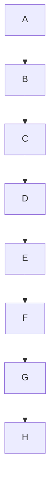
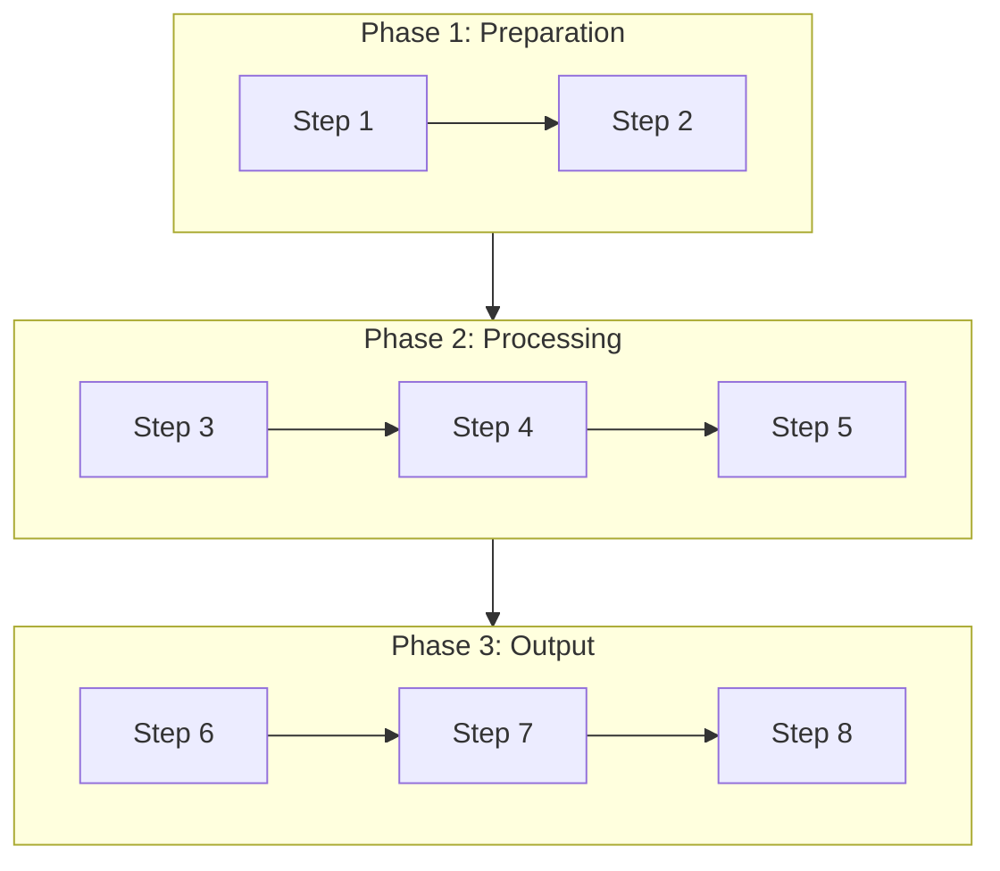
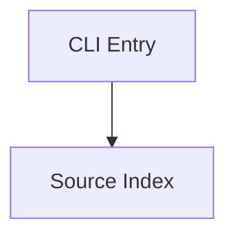
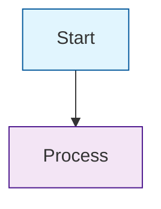

# Mermaid Syntax Reference

> **Audience**: Claude (used in code generation context).
> This is the authoritative reference for Mermaid diagram rules enforced by Nium-Wiki.
> Skipping these rules causes **silent render failures** (blank or broken diagrams).

## 1. Diagram Complexity Optimization

When linear flowcharts exceed 6 nodes, **MUST** apply visual optimization to avoid long, narrow waterfall-style diagrams.

| Node Count | Optimization Strategy | Description |
|------------|----------------------|-------------|
| <= 6 | No optimization needed | Use linear flow directly |
| 7-12 | `subgraph` grouping | Group into subgraphs: 2–4 nodes each, max 5 |
| 13-20 | Layered abstraction | High-level overview + detailed phase diagrams |
| > 20 | Split into multiple diagrams | Each diagram focuses on one phase, linked via cross-references |

**Grouping principles**:
- Group by business phases (e.g., Initialization, Detection, Collection, Output)
- Each `subgraph` contains 2-4 nodes, max 5
- Connect subgraphs with concise edges to show phase transitions
- Add semantic titles to subgraphs: `subgraph PhaseName[Phase Title]`

**Example — Avoid linear waterfall**:



**Recommended — Grouped by phase**:



## 2. Syntax Safety Rules (Mermaid v10.9+ Compatible)

### Node Labels — No Quotes Needed for Plain Labels

Mermaid's `ID[label]` format does **not** use quotes around plain labels. Quotes are only valid for tooltips via the two-argument form `ID["tooltip","label"]`.



### Node IDs — Alphanumeric Only

Use only `[a-zA-Z0-9_]` in node IDs. Non-ASCII characters in IDs cause compatibility issues.

```mermaid
%% WRONG — non-alphanumeric ID (dot and Chinese characters are not allowed)
CoreModule_123[Core Module]

%% CORRECT — alphanumeric only (underscore is allowed)
CoreModule_123[Core Module]
CoreModule[Core Module]
```

### subgraph IDs — English Only

subgraph IDs must be English alphanumeric. Non-ASCII subgraph IDs produce unstable rendering across Mermaid versions.

```mermaid
%% WRONG — non-ASCII subgraph ID
subgraph 核心层[Core Layer]

%% CORRECT — English alphanumeric subgraph ID
subgraph CoreLayer[Core Layer]
```

### subgraph ID vs Node ID — Shared Namespace

subgraph IDs and node IDs share a **single namespace**. A subgraph ID must **not** duplicate any node ID in the same diagram.

```mermaid
%% WRONG — subgraph ID "CLI" collides with node ID "CLI"
flowchart TB
    subgraph CLI[CLI Layer]
        CLI_node[cli.ts] --> C2[commands]
    end
    CLI_node --> A[Analyzer]  %% ERROR: CLI already used as subgraph ID

%% CORRECT — use distinct IDs
flowchart TB
    subgraph CL[CLI Layer]
        CLI_node[cli.ts] --> C2[commands]
    end
    CLI_node --> A[Analyzer]
    CL --> A
```

### Labels with Special Characters — Escape Inner Quotes with HTML Entities

When a label itself contains a double-quote character, escape it with `&quot;`.

```mermaid
%% WRONG — unescaped quotes inside label
flowchart TD
    A[Config "key" value]

%% CORRECT — escaped inner quotes
flowchart TD
    A[Config &quot;key&quot; value]
```

### sequenceDiagram Participants — Alphanumeric IDs

Participant IDs in `sequenceDiagram` must be alphanumeric.

```mermaid
%% WRONG — non-alphanumeric participant ID (dot is not allowed)
participant User.123

%% CORRECT — alphanumeric only (underscore is allowed)
participant User_123
participant User as User123
```

### Reserved Keywords — Avoid as IDs

Mermaid has reserved words (`class`, `graph`, `digraph`, `subgraph`, `end`, `click`, `style`, etc.) that must not be used bare as IDs.

```mermaid
%% WRONG — "class" is a reserved word
flowchart TD
    class[class]

%% CORRECT — rename to avoid conflict
flowchart TD
    NodeClass[class]
```

## 3. One-Line Principle

> **IDs: English alphanumeric | Labels: unquoted | Special chars: HTML entities**

## 4. Layout Direction

Choose the chart direction by content type:

| Direction | Use When |
|-----------|---------|
| `TB` (Top→Bottom) | Hierarchies, inheritance, call trees |
| `LR` (Left→Right) | Flows, dependencies, pipelines |
| `BT` (Bottom→Top) | Reversed hierarchies (rare) |
| `RL` (Right→Left) | Reverse flows (rare) |

## 5. Color Coding

Use `style` to highlight key nodes:


