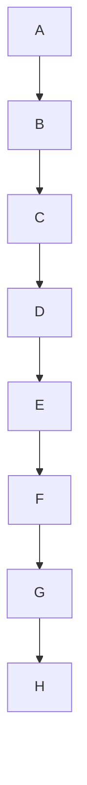
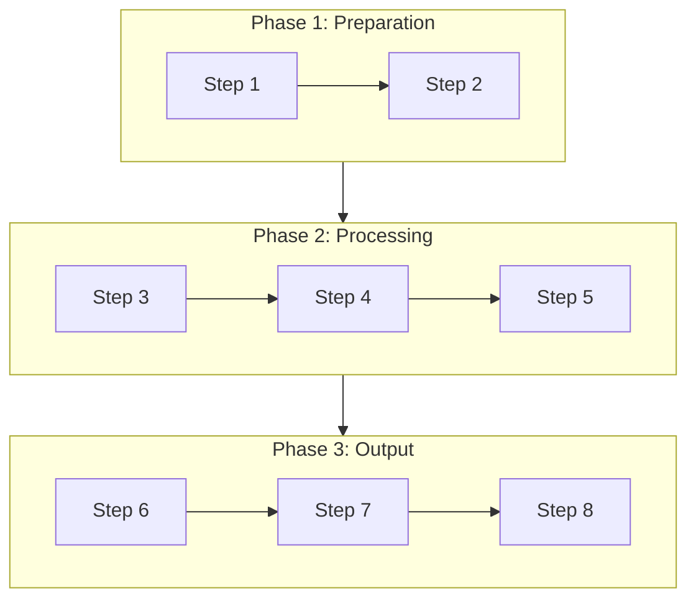
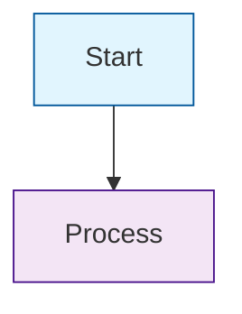

# Mermaid Syntax Reference

> **Audience**: Claude (used in code generation context).
> This is the authoritative reference for Mermaid diagram rules enforced by Nium-Wiki.
> Rules marked as ⚠️ are suggestions for best practices, not hard requirements.

## 1. Diagram Complexity Optimization

When linear flowcharts exceed 6 nodes, **MUST** apply visual optimization to avoid long, narrow waterfall-style diagrams.

| Node Count | Optimization Strategy | Description |
|------------|----------------------|-------------|
| <= 6 | No optimization needed | Use linear flow directly |
| 7-12 | `subgraph` grouping | Group into subgraphs: 2–4 nodes each, max 5 |
| 13-20 | Layered abstraction | High-level overview + detailed phase diagrams |
| > 20 | Split into multiple diagrams | Each diagram focuses on one phase, linked via cross-references |

**Grouping principles**:
- Group by business phases (e.g., Initialization, Detection, Collection, Output)
- Each `subgraph` contains 2-4 nodes, max 5
- Connect subgraphs with concise edges to show phase transitions
- Add semantic titles to subgraphs: `subgraph PhaseName[Phase Title]`

**Example — Avoid linear waterfall**:

```mermaid
%% WRONG — narrow waterfall with no structure
flowchart TD
    A --> B --> C --> D --> E --> F --> G --> H
```

**Recommended — Grouped by phase**:

```mermaid
%% CORRECT — grouped into logical phases
flowchart TD
    subgraph Phase1[Phase 1: Preparation]
        A[Step 1] --> B[Step 2]
    end
    subgraph Phase2[Phase 2: Processing]
        C[Step 3] --> D[Step 4] --> E[Step 5]
    end
    subgraph Phase3[Phase 3: Output]
        F[Step 6] --> G[Step 7] --> H[Step 8]
    end
    Phase1 --> Phase2 --> Phase3
```

## 2. Syntax Safety Rules (Mermaid v10.9+ Compatible)

### ⚠️ Node Labels — Two Formats Supported

Mermaid supports two label formats:
- **Plain labels**: `A[Label Text]` — no quotes needed
- **Quoted labels**: `A["Label Text"]` — quotes for Unicode and special characters

Both formats are **officially supported**. Use whichever is more readable.

```mermaid
%% CORRECT — plain label (simple text)
flowchart TD
    A[Start] --> B[Process]

%% CORRECT — quoted label (Unicode or special chars)
flowchart TD
    A["Start ↑"] --> B["处理中 →"]
```

### ⚠️ Node IDs — Alphanumeric is Recommended but Not Required

Mermaid supports Unicode node IDs. However, **alphanumeric IDs are recommended** for:
- Better compatibility with older Mermaid versions
- Easier to reference in edges and styles

```mermaid
%% RECOMMENDED — alphanumeric IDs
flowchart TD
    CoreModule_123[Core Module]

%% ALSO VALID — Unicode IDs work in Mermaid v10+
flowchart TD
    核心模块[Core Module]
```

### ⚠️ Subgraph IDs — Alphanumeric is Recommended but Not Required

```mermaid
%% RECOMMENDED — English alphanumeric IDs
subgraph CoreLayer[Core Layer]

%% ALSO VALID — Unicode IDs work in Mermaid v10+
subgraph 核心层[Core Layer]
```

### ⚠️ sequenceDiagram Participants — Alphanumeric is Recommended

```mermaid
%% RECOMMENDED — alphanumeric participant IDs
sequenceDiagram
    participant User_123
    participant Server as ServerBackend

%% ALSO VALID — dots work but may cause issues in some contexts
sequenceDiagram
    participant User.123
```

### ✅ subgraph ID vs Node ID — Shared Namespace (HARD RULE)

subgraph IDs and node IDs share a **single namespace**. A subgraph ID must **not** duplicate any node ID in the same diagram — this causes render errors.

```mermaid
%% WRONG — subgraph ID "CLI" collides with node ID "CLI"
flowchart TB
    subgraph CLI[CLI Layer]
        CLI_node[cli.ts] --> C2[commands]
    end
    CLI_node --> A[Analyzer]  %% ERROR: CLI already used as subgraph ID

%% CORRECT — use distinct IDs
flowchart TB
    subgraph CL[CLI Layer]
        CLI_node[cli.ts] --> C2[commands]
    end
    CLI_node --> A[Analyzer]
    CL --> A
```

### ✅ Labels with Special Characters — Escape Inner Quotes (HARD RULE)

When a **plain label** (without quotes) contains a double-quote character, escape it with `&quot;`.

```mermaid
%% WRONG — unescaped quote in plain label (causes parser error)
flowchart TD
    A[Config "key" value]

%% CORRECT — escaped inner quote in plain label
flowchart TD
    A[Config &quot;key&quot; value]

%% CORRECT — use quoted label instead
flowchart TD
    A["Config \"key\" value"]
```

### ✅ Reserved Keywords — Avoid as Bare IDs (HARD RULE)

Mermaid has reserved words that cause parser errors when used as bare IDs.

```mermaid
%% WRONG — "class" is a reserved word
flowchart TD
    class[class]

%% CORRECT — rename to avoid conflict
flowchart TD
    NodeClass[class]
```

Reserved keywords: `class`, `graph`, `digraph`, `subgraph`, `end`, `click`, `style`, `state`, `note`

## 3. Summary

| Rule Type | Examples | Enforcement |
|-----------|----------|-------------|
| **⚠️ Suggestions** | Quoted labels, Unicode IDs | Warn only (not required) |
| **✅ Hard Rules** | ID collision, reserved keywords, unescaped quotes | Error (blocks generation) |

## 4. Layout Direction

Choose the chart direction by content type:

| Direction | Use When |
|-----------|----------|
| `TB` (Top→Bottom) | Hierarchies, inheritance, call trees |
| `LR` (Left→Right) | Flows, dependencies, pipelines |
| `BT` (Bottom→Top) | Reversed hierarchies (rare) |
| `RL` (Right→Left) | Reverse flows (rare) |

## 5. Color Coding

Use `style` to highlight key nodes:

```mermaid
flowchart TD
    A[Start] --> B[Process]
    style A fill:#e1f5fe,stroke:#01579b
    style B fill:#f3e5f5,stroke:#4a148c
```
