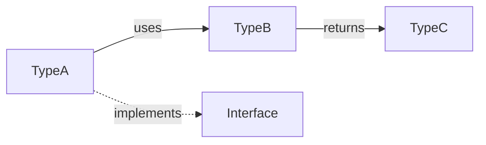

# Template: API Doc (`api/<name>.md`)

<!--
  This template defines the structure for API reference documentation.

  This is the single source of truth for API signatures, parameters, and types.

  Replace {{ placeholders }} with actual API content.
-->

---

# {{ MODULE_NAME }} API Reference

## Module Overview / 模块概述

<!--
  Brief overview with import example.
-->

{{ MODULE_OVERVIEW }}

<!-- Source: [{{ IMPORT_SOURCE_FILE }}](/{{ IMPORT_SOURCE_PATH }}#L{{ IMPORT_START }}-L{{ IMPORT_END }}) -->
```{{ LANGUAGE }}
{{ IMPORT_EXAMPLE }}
```

## API Overview / API 概览

<!--
  API overview table.
-->

| API | Type | Description |
|-----|------|-------------|
| `{{ API_1 }}` | {{ TYPE_1 }} | {{ API_1_DESC }} |
| `{{ API_2 }}` | {{ TYPE_2 }} | {{ API_2_DESC }} |
| `{{ API_3 }}` | {{ TYPE_3 }} | {{ API_3_DESC }} |

## Type Definitions / 类型定义

<!--
  Type definitions with property tables.
-->

### `{{ TYPE_NAME }}`

<!-- Source: [{{ TYPE_SOURCE_FILE }}](/{{ TYPE_SOURCE_PATH }}#L{{ TYPE_START }}-L{{ TYPE_END }}) -->
```{{ LANGUAGE }}
{{ TYPE_DEFINITION }}
```

| Property | Type | Required | Default | Description |
|----------|------|----------|---------|-------------|
| {{ PROP_1 }} | `{{ PROP_1_TYPE }}` | {{ REQUIRED }} | {{ DEFAULT }} | {{ PROP_1_DESC }} |
| {{ PROP_2 }} | `{{ PROP_2_TYPE }}` | {{ REQUIRED }} | {{ DEFAULT }} | {{ PROP_2_DESC }} |

## Functions / 函数

<!--
  For each function: signature, params, returns, exceptions, 1-3 code examples.

  Example count depends on API complexity:
  - Simple utility functions: 1 example (basic usage)
  - Moderate functions: 2 examples (basic + advanced or error handling)
  - Complex functions with multiple modes: 3 examples (basic + advanced + error handling)
-->

### `{{ FUNCTION_NAME }}`

```{{ LANGUAGE }}
{{ FUNCTION_SIGNATURE }}
```

**Parameters / 参数:**

| Parameter | Type | Required | Default | Description |
|-----------|------|----------|---------|-------------|
| {{ PARAM_1 }} | `{{ PARAM_1_TYPE }}` | {{ REQUIRED }} | {{ DEFAULT }} | {{ PARAM_1_DESC }} |
| {{ PARAM_2 }} | `{{ PARAM_2_TYPE }}` | {{ REQUIRED }} | {{ DEFAULT }} | {{ PARAM_2_DESC }} |

**Returns / 返回值:** `{{ RETURN_TYPE }}` — {{ RETURN_DESC }}

**Exceptions / 异常:**

| Exception | Condition |
|-----------|-----------|
| `{{ EXCEPTION_1 }}` | {{ CONDITION_1 }} |

**Example: Basic Usage / 基础用法**

```{{ LANGUAGE }}
{{ EXAMPLE_1_CODE }}
```

<!--
  OPTIONAL: Add more examples if the API is complex enough to warrant them.
-->

**Section sources**
- [{{ SOURCE_FILE }}](/{{ SOURCE_PATH }}#L{{ START }}-L{{ END }})

## Type Relationships / 类型关系图

<!--
  OPTIONAL: Include only if the module has multiple types/interfaces with meaningful relationships.
  Use flowchart LR to show how types relate (implements, extends, uses, etc.).
  Omit if the module has only one or two simple types.
-->



## Usage Patterns / 使用模式

<!--
  Common usage patterns and recipes.
-->

### {{ PATTERN_1_NAME }}

{{ PATTERN_1_DESCRIPTION }}

```{{ LANGUAGE }}
{{ PATTERN_1_CODE }}
```

## FAQ

<!--
  OPTIONAL: Include for complex APIs with common pitfalls.
  Skip this section for straightforward APIs.
-->

## Deprecated APIs / 废弃 API

<!--
  OPTIONAL: Include only if the module has deprecated APIs.
  For each deprecated API, document what to use instead.
-->

| Deprecated API | Replacement | Removed In | Migration Guide |
|----------------|-------------|------------|----------------|
| `{{ DEPRECATED_API }}` | `{{ REPLACEMENT_API }}` | `{{ VERSION }}` | {{ MIGRATION_GUIDE }} |

## Related Documents / 相关文档

- [{{ PARENT_MODULE }}]({{ PARENT_MODULE_PATH }}) — Parent module documentation

---

*Generated by [Nium-Wiki v{{ NIUM_WIKI_VERSION }}](https://github.com/niuma996/nium-wiki) | {{ GENERATED_AT }}*
