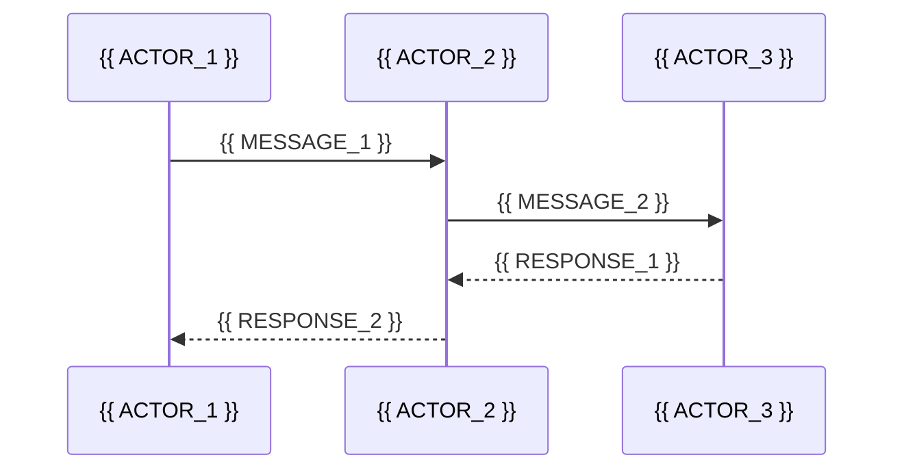

# Template: Architecture Doc (`architecture.md`)

<!--
  This template defines the structure for the system architecture document.
  本模板定义系统架构文档的结构。

  Replace {{ placeholders }} with actual project content.
  将 {{ 占位符 }} 替换为实际项目内容。
-->

---

# System Architecture / 系统架构

## Executive Summary / 执行摘要

<!--
  2-3 paragraphs summarizing the system architecture / 2-3 段系统架构摘要
  - Overall architecture style (monolith, microservices, modular, etc.)
  - Key design decisions and rationale
  - System boundaries and integration points
-->

{{ EXECUTIVE_SUMMARY }}

## System Architecture Diagram / 系统架构图

<!--
  MANDATORY: Mermaid flowchart TB with subgraphs / 必须：Mermaid flowchart TB + subgraph
  Group components by layer or domain
-->

```mermaid
flowchart TB
    subgraph {{ LAYER_1 }}["{{ LAYER_1_LABEL }}"]
        {{ COMPONENT_A }}["{{ COMPONENT_A_LABEL }}"]
        {{ COMPONENT_B }}["{{ COMPONENT_B_LABEL }}"]
    end
    subgraph {{ LAYER_2 }}["{{ LAYER_2_LABEL }}"]
        {{ COMPONENT_C }}["{{ COMPONENT_C_LABEL }}"]
        {{ COMPONENT_D }}["{{ COMPONENT_D_LABEL }}"]
    end
    subgraph {{ LAYER_3 }}["{{ LAYER_3_LABEL }}"]
        {{ COMPONENT_E }}["{{ COMPONENT_E_LABEL }}"]
    end
    {{ COMPONENT_A }} --> {{ COMPONENT_C }}
    {{ COMPONENT_B }} --> {{ COMPONENT_D }}
    {{ COMPONENT_C }} --> {{ COMPONENT_E }}
```

**Section sources**
- [{{ SOURCE_FILE_1 }}](/{{ SOURCE_PATH_1 }})

## Tech Stack / 技术栈

<!--
  Table with version and selection rationale / 技术栈表（含版本和选型理由）
-->

| Technology | Version | Purpose | Selection Rationale |
|-----------|---------|---------|-------------------|
| {{ TECH_1 }} | {{ VERSION_1 }} | {{ PURPOSE_1 }} | {{ RATIONALE_1 }} |
| {{ TECH_2 }} | {{ VERSION_2 }} | {{ PURPOSE_2 }} | {{ RATIONALE_2 }} |
| {{ TECH_3 }} | {{ VERSION_3 }} | {{ PURPOSE_3 }} | {{ RATIONALE_3 }} |

## Module Dependency Diagram / 模块依赖图

<!--
  MANDATORY: Mermaid flowchart showing module dependencies / 必须：模块依赖关系图
-->

```mermaid
flowchart LR
    {{ MODULE_A }} --> {{ MODULE_B }}
    {{ MODULE_A }} --> {{ MODULE_C }}
    {{ MODULE_B }} --> {{ MODULE_D }}
    {{ MODULE_C }} --> {{ MODULE_D }}
```

**Diagram sources**
- [{{ SOURCE_FILE_2 }}](/{{ SOURCE_PATH_2 }})

## Detailed Module Descriptions / 详细模块描述

<!--
  For each major module: name, responsibility, key interfaces, dependencies
  每个主要模块：名称、职责、关键接口、依赖
-->

### {{ MODULE_1_NAME }}

{{ MODULE_1_DESCRIPTION }}

- **Responsibility / 职责**: {{ MODULE_1_RESPONSIBILITY }}
- **Key interfaces / 关键接口**: {{ MODULE_1_INTERFACES }}
- **Dependencies / 依赖**: {{ MODULE_1_DEPENDENCIES }}

### {{ MODULE_2_NAME }}

{{ MODULE_2_DESCRIPTION }}

## Data Flow Diagram / 数据流图

<!--
  OPTIONAL: Include for multi-component or client-server projects.
  可选：适用于多组件交互或客户端-服务端项目。

  Skip for single-component or linear-flow applications.
  单组件或线性流程的应用可跳过。

  Use Mermaid sequenceDiagram to show key data flows between components.
-->



## State Management Diagram / 状态管理图

<!--
  OPTIONAL: Include only if the project has global state management
  (Redux, Vuex, state machines, etc.)
  可选：仅在项目有全局状态管理时包含（Redux、Vuex、状态机等）

  Skip this section entirely for stateless or simple-state projects.
  无状态或状态简单的项目请跳过此节。

  Use Mermaid stateDiagram-v2 to show key state transitions.
-->

## Directory Structure / 目录结构

<!--
  Auto-generated by `npx nium-wiki analyze`. Do not edit manually.
  由 `npx nium-wiki analyze` 自动生成，请勿手动编辑。

  Project directory tree with explanations / 项目目录树（含说明）
-->

```
{{ PROJECT_ROOT }}/
├── {{ DIR_1 }}/          # {{ DIR_1_DESC }}
│   ├── {{ FILE_1 }}      # {{ FILE_1_DESC }}
│   └── {{ FILE_2 }}      # {{ FILE_2_DESC }}
├── {{ DIR_2 }}/          # {{ DIR_2_DESC }}
└── {{ DIR_3 }}/          # {{ DIR_3_DESC }}
```

## Design Patterns & Principles / 设计模式与原则

<!--
  Document design patterns used and architectural principles / 记录使用的设计模式和架构原则
-->

| Pattern / Principle | Where Used | Rationale |
|-------------------|-----------|-----------|
| {{ PATTERN_1 }} | {{ WHERE_1 }} | {{ WHY_1 }} |
| {{ PATTERN_2 }} | {{ WHERE_2 }} | {{ WHY_2 }} |

## Related Documents / 相关文档

- [Homepage](index.md)
- [Getting Started](getting-started.md)
- [Doc Map](doc-map.md)

---

*Generated by [Nium-Wiki v{{ NIUM_WIKI_VERSION }}](https://github.com/niuma996/nium-wiki) | {{ GENERATED_AT }}*
